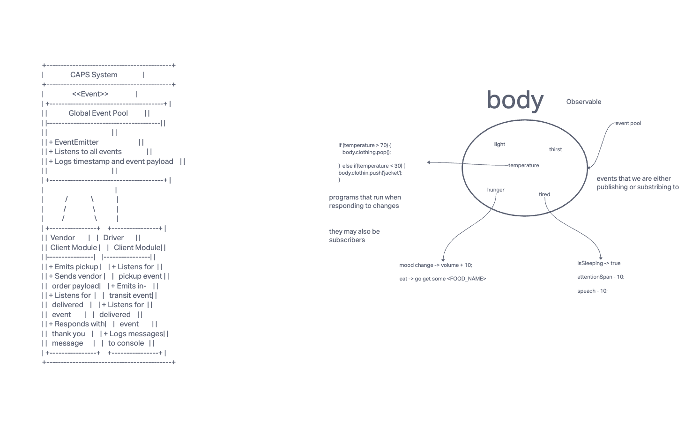

# CAPS - The Code Academy Parcel Service

## Overview

CAPS is an event-driven Node.js application that simulates a supply chain system. Vendors use CAPS to deliver products, and drivers ensure timely deliveries while keeping vendors informed.

## Business Requirements

* Vendors alert the system when they have packages for pickup.
* Drivers receive notifications of packages to deliver.
* Drivers notify the system when they pick up a package and when it's in transit.
* Drivers also notify when a package is delivered.
* Vendors receive notifications when their packages are delivered.

## Phase 1 Requirements

* Set up an event pool and handler functions.
* Implement a Global Event Pool (HUB).
* Create modules for managing vendor and driver events.
* Ensure real-time event-driven communication.

## Technical Requirements/Notes

* Global Event Pool (HUB) for event handling.
* Modules for managing package events.
* Unit tests for handler functions.
* Chatbot integration for generating test code.

